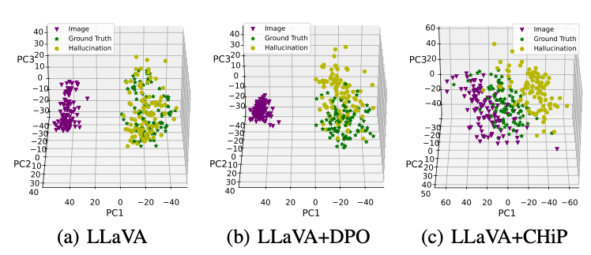
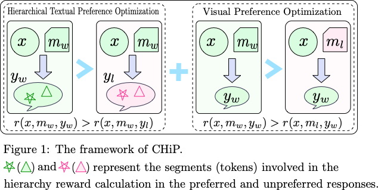

#  CHiP: Cross-modal Hierarchical Direct Preference Optimization for Multimodal LLMs


**ICLR 2025**

**National University of Singapore**

This repository provides the code and data for **CHiP**, a direct preference optimization algorithm aimed at mitigating hallucinations in multimodal large language models (MLLMs) and enhancing cross-modal semantic alignment. 


## Brief Introduction 


- **The capabilities of ideally well-aligned MLLMs.** Ideally, for well-aligned MLLMs, the representations of an image and its ground-truth description should be as close as possible, while the representations of ground-truth and hallucinated descriptions should be more distant.


<p align="center" width="100%">
<a target="_blank"></a>
</p>


 <!--  -->


- **The gap between existing MLLMs, MLLMs with DPO, and the ideal state.** (1) LLaVA and LLaVA+DPO struggles to align image and description representations and to effectively distinguish between hallucinated and non-hallucinated descriptions. (2) The proposed CHiP method, which incorporates both image and fine-grained text preferences, achieves better alignment between images and ground-truth descrip- tions while increasing the distance between ground-truth and hallucinated descriptions.


- ** The framework of CHiP. ** CHiP comprises a hierarchical text preference optimization module that captures fine-grained preferences at the response, segment, and token levels, along with a visual preference optimization module that extracts cross-modal preferences.

<p align="center" width="100%">
<a target="_blank"></a>
</p>


 <!--  -->


For more technical details, kindly refer to the [paper](https://arxiv.org/pdf/2501.16629). 


## Contents
- [1. Preparing Dataset](#data)
- [2. Environment Preparation](#install)
- [3. Training](#training)
- [4. Evaluation](#evaluation)


## 1. Preparing Dataset 

### 1.1 Training Dataset
There are several publicly available training datasets that include preference pairs for multimodal hallucinations. Here, we choose to use the [RLHF-V Dataset](https://github.com/RLHF-V/RLHF-V). You can download from [HuggingFace](https://huggingface.co/datasets/openbmb/RLHF-V-Dataset).


### 1.2 Evaluation Dataset

The evaluation datasets are publicly available and widely used. They can be downloaded from their official websites and placed in the `playground/data` directory.

The evaluation datasets used in this study and their download links are listed below:
* Object HalBench (ObjHal) (Download from [here](https://github.com/RLHF-V/RLHF-V/blob/main/eval/data/obj_halbench_mhumaneval_data_with_image.jsonl)!)
* MMHal-Bench (MMHal) (Download from [here](https://huggingface.co/datasets/Shengcao1006/MMHal-Bench)!)
* HallusionBench (Download from [here](https://github.com/tianyi-lab/HallusionBench)!)
* AMBER (Download from [here](https://github.com/junyangwang0410/AMBER)!)


## 2. Environment Preparation

1. Clone this repository and navigate to source folder
```bash
cd CHiP
```

2. Build Environment 


```Shell


echo "Creating conda environment"
conda create -n CHiP python=3.10
conda activate CHiP

echo "Installing dependencies"
pip install -e .
```


## 3. Training

* #### LLaVA CHiP/DPO Training
```Shell

bash scripts/chip.sh
bash scripts/cmdpo.sh
bash scripts/dpo.sh
```

* #### MUFFIN CHiP/DPO Training
```Shell

bash muffin/script/train/chip.sh
bash muffin/script/train/dpo.sh
```


## 4. Evaluation

1. Run inference to generate responses

```py
python llava_inference.py --model_name {ckpt_name} --test_datasets {test_datasets} --eval_output {eval_output} 
python muffin/muffin/eval/inference.py --model_name {ckpt_name} --test_datasets {test_datasets} --eval_output {eval_output} 
```


2. Evaluate the generated responses.

```py
python ./muffin/muffin/eval/get_score.py --file {eval_output}
```

3. Evaluate Object HalBench 
* Prepare COCO2014 annotations. 
The evaluation of Object HalBench relies on the caption and segmentation annotations from the COCO2014 dataset. Please first download the COCO2014 dataset from the COCO dataset's official website.

```bash
mkdir coco2014
cd coco2014

wget http://images.cocodataset.org/annotations/annotations_trainval2014.zip

unzip annotations_trainval2014.zip
```

```py
# eval with gpt-4
python ./muffin/muffin/eval/eval_gpt_obj_halbench.py --cap_file {cap_file} --openai_key {api_key}
```

```py
python ./muffin/muffin/eval/summarize_gpt_obj_halbench_review.py --cap_file {cap_file} 
```

4. Evaluate MMHal Bench

* Please download the MMHal evaluation data [here](https://drive.google.com/file/d/1mQyAbeGgRyiVV6qjVkUI1uY_g9E-bDTH/view?usp=sharing), and save the file in `playground/data/`.
```py
# eval with gpt-4
python ./muffin/muffin/eval/eval_gpt_mmhal.py --response {response} --openai_key {api_key}
```
5. Evaluate HallusionBench

```py
# Firstly, prepare the response format 
python ./muffin/muffin/eval/eval_public.py # use eval_hallusionbench function
```
* Secondly, refer to [HallusionBench](https://github.com/tianyi-lab/HallusionBench.git)
```py
python HallusionBench/evaluation.py
```

6. Evaluate AMBER

```py
# Firstly, prepare the response format
python ./muffin/muffin/eval/eval_public.py # use eval_amber function
```
* Secondly, refer to [AMBER](https://github.com/junyangwang0410/AMBER.git)
```py
python AMBER/inference.py
```

## Citation

If you find CHiP useful in your research or applications, please kindly cite:

```
@inproceedings{fu2025chip,
  title={CHiP: Cross-modal Hierarchical Direct Preference Optimization for Multimodal LLMs},
  author={Fu, Jinlan and Huangfu, Shenzhen and Fei, Hao and Shen, Xiaoyu and Hooi, Bryan and Qiu, Xipeng and Ng, See-Kiong},
  journal={Proceedings of the International Conference on Learning Representations},
  year={2025}
}

```


## Acknowledgement

Our CHiP is developed based on the codebases of [LLaVA](https://github.com/haotian-liu/LLaVA) and [Muffin](https://github.com/thunlp/muffin), and we would like to thank the developers of both.


